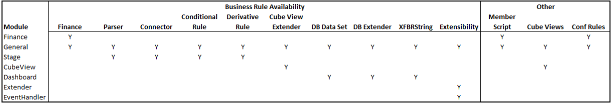

# AWSnippets
A package to build OneStream's snippets

Download it from https://awsoftware.blob.core.windows.net/packagesdev/awsnippets/AWSnippets.zip

ChangeLog is here: https://awsoftware.blob.core.windows.net/packagesdev/awsnippets/AWSnippets_CHANGELOG.md

To install snippets just grab the above mentioned zip file and load it into OneStream through the **Application Load/Extract** procedure.

## Directory Structure
The main directories in this project are

- **Commons** - Here are the common parts of the snippets, attached at the beginning (Pre) and/or End (Post) of each snippet.
- **Snippets** - The actual snippets, divided into their own Categories.

Each snippet should come in two flavours: C# (extension is **.cs**) and Visual Basic (extension is **.vb**).

## How snippets are organized
The directory at first level under Snippets represent the Module Type (they are defined by OneStream):

- General
- Finance 
- Stage
- CubeView
- Dashboard
- Extender
- Event Handler

The following grid shows each module’s availability in the Business Rules and other areas of OneStream.
 

## File format
Valid file formats are .cs or .vb 

The first three lines are triple slash comments:

- The first line represent the snippet's name
- The second line represent the snippet's description
- The third line contains the comma separated search terms

The fourth line must be left blank (it's ignored when )

The snippet starts at the fifth line

Example:

    /// Snippet Name
    /// Snippet description
    /// Term1, Term2, Term3

    string s = ""; // This is the first line of the script

Files starting with "todo_" won't be included in the final Zip file.

## Distribution
Every commit automatically generates an updated release of the Snippets (see the above mentioned links).